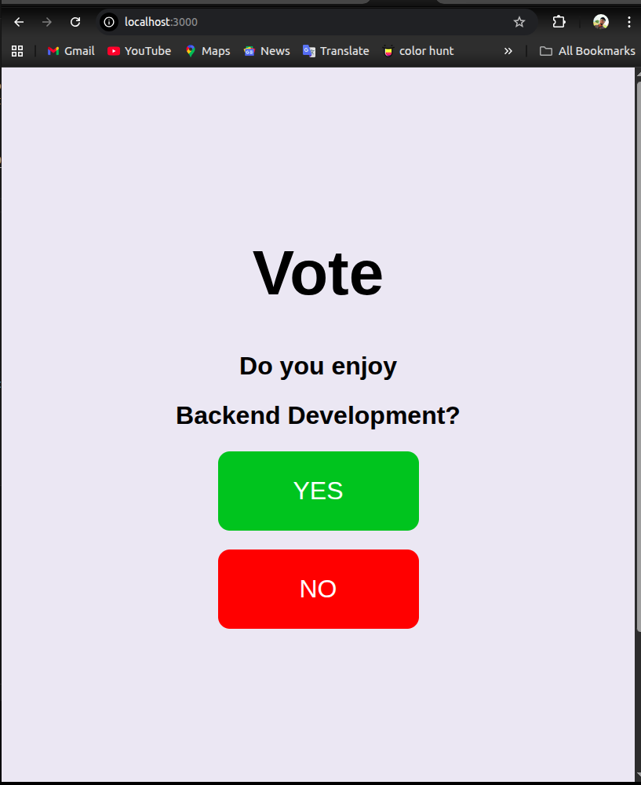
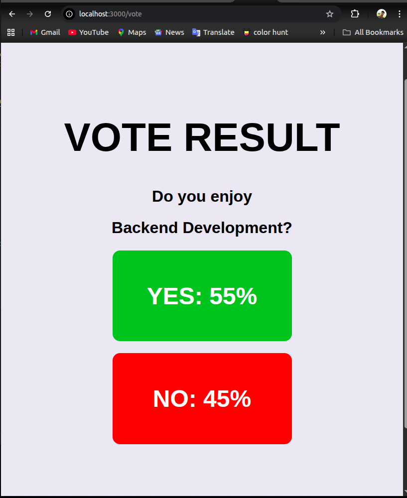

# vote

Vote is a simple polling web server that allows users vote between two choices (YES or NO) and displays the vote rusult as the percentage of each voting option from the combined total votes.

Contributors please read the [collaboration guidelines](./COLLABORATION.md).

## Demo
  

## END POINTS
### Home
- The home route `http://localhost:3000` uses the **GET HTTP method**. 
- Does **NOT** require any parameter or query string.
- It renders the voting page for users yet to vote.
- It renders the result page for users who already voted.
- Returns **200 STATUS CODE**
- [See route in postman](https://uche09-6754057.postman.co/workspace/uche09's-Workspace~b3a89bc7-35e1-43ec-884b-f92280b950f5/request/48923781-32eb18f4-e247-4725-a821-40237d36bc59?action=share&creator=48923781)

### Vote
- The vote route `http://localhost:3000/vote` uses the **POST HTTP method**.
- Requires a urlencoded form data in body containving a `vote` value.  

|**Body** (urlencoded)|    |
| :---                |:--:|
|vote                 | yes|        

- [See route in postman](https://uche09-6754057.postman.co/workspace/uche09's-Workspace~b3a89bc7-35e1-43ec-884b-f92280b950f5/request/48923781-bfcc2021-ecd0-4c1d-b3f4-091b4cb5bc80?action=share&creator=48923781)
    
**OR**
  
|**Body** (urlencoded)|    |
| :---                |:--:|
|vote                 | no |

- [See route in postman](https://uche09-6754057.postman.co/workspace/uche09's-Workspace~b3a89bc7-35e1-43ec-884b-f92280b950f5/request/48923781-54eb8783-4708-4886-a936-3f6835bb52ac?action=share&creator=48923781)

- Returns **STATUS CODE 200** on a successful vote.
- Returns **STATUS CODE 400** if user attempts to vote multiple times.
- Renders the result page to see result.
- Stores cookie to identify already voted users.

## Stack
- Node.js (ESM)
- Express
- EJS
- HTML
- CSS
- Git
